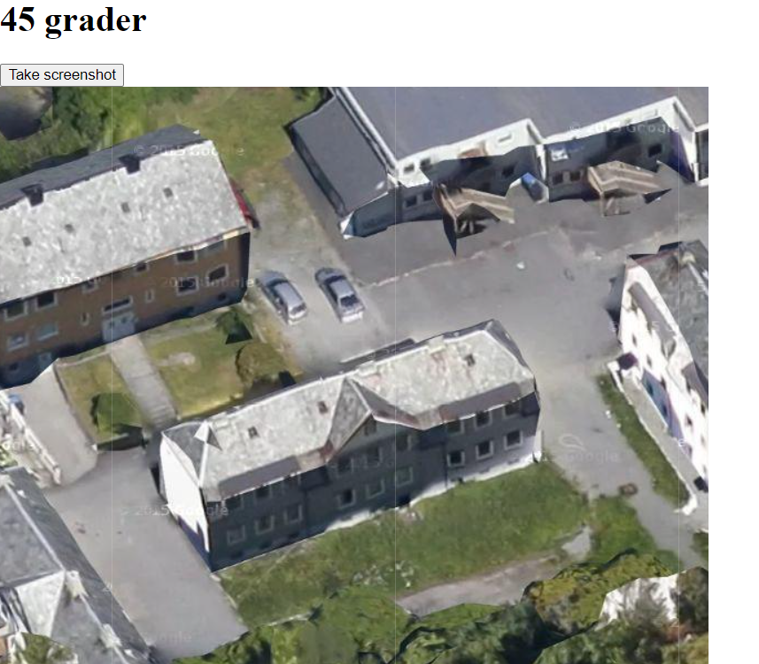
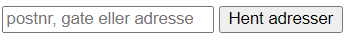
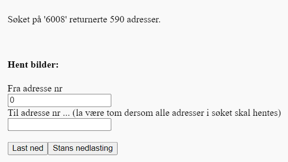
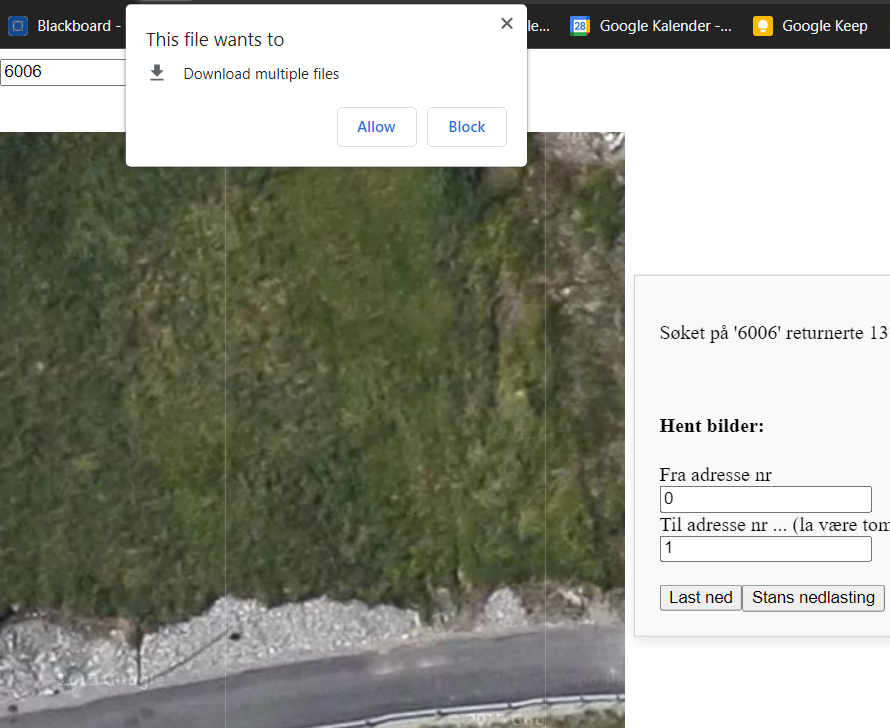

# Building detection/color classification model

## Table of Contents
1. [About the project](#about)
2. [Overview](#overview)
3. [Setup](#setup)
4. [Usage](#usage)
    - [Downloading images](#download)
    - [Running the model](#model)
5. [Prototyping](#prototyping)
6. [API reference](#api)
7. [Documentation](#docs)
8. [Contact](#contact)


## About the project <a name="about"></a>
A summer student project by students at the TEFT Lab in Ålesund for Kystverket. We utilized the YOLO algorithm and Google Maps API to detect buildings and classify their color from image data. The project aims to create a database of building colors to be used in Kystverkets' digital twin application for more realistic representation. It is still a work in progress, but we currently have a semi-automatic system for classifying buildings based on address location. It can be used for testing on a small geographical area and further development. More information about the project and our thoughts on the way forward can be found in the [documentation](#docs), which should be read before starting. 

## Overview <a name="overview"></a>
**NB! Ikke ferdig**
### Important contents ###
- `index.html` is used for fetching images to be put into the model. The functionality lies within `js/automatic-screenshot.js`
- The `yolo_implementation` folder contains our deployment of the YOLO model.
- The `tools` folder contains code for fetching images for constructing a dataset to train the model on.
- `training_data` contains some unlabeled images which can be used to build a new dataset to train your own model on. Please note that these images have already been used to train our model. 
- `prototyping` contains some tests we did with other image sources.

## Setup <a name="setup"></a>
1. Clone or fork the repository
2. Obtain a Google Maps API key from https://developers.google.com/maps/documentation/javascript/get-api-key
3. Enter your API_KEY in the `config.js.template` file inside the `config` folder. Save the file as `config.js` in the same folder.
```js
API = {"API_KEY": "your-API key"}
////////////////////////////
//This is a template for the config.js file that should be added to run
//the different scripts. Add your personal google API key to this file.
//When this is done, rename the file to "config.js"
```
This should be enough to run all the code except the `csv-reader.js` inside `prototyping/google_45degree`. More information about the prototypes can be read in the separate section on [prototyping](#prototyping). 

## Usage <a name="usage"></a>

### Building a dataset
In this project we used [roboflow](https://roboflow.com/) to create our own dataset for building the model. Please refer to the [documentation](#docs) for further details on how to construct a dataset. To fetch the images we used a tool inside `tools` which allows the user quickly grab screenshots of specific buildings. To use it open the `tool.html` file. This will render four different Google Maps views. Center the building you want by clicking the topmost map. This should automatically center all the maps. Sometimes you will need manual adjustment of a map to get a good image, so make sure to double check before downloading. Download the images by clicking on the 'Take screenshot' button. 
 
<br>

### Model

The process of classifying building colors is currently split into two steps. First we download images of the address locations we are interested in. Then we run the model on the downloaded images. This is not ideal, but should be a solvable issue. However it is where we are currently at. The issue arises from the fact that the images we get are screenshots of Google Map views, and not just images fetched directly from an API. Our further thoughts about how to combat this issue going forward can be found in `link to latex document`. The steps to use the model are:
### Downloading Images:<a name="download"></a>
1. Open the `index.html` file
2. Enter the address or postalcode you want to get images from. This will send an API request to the [Open Address API from Kartverket](https://ws.geonorge.no/adresser/v1/).

    

3. That should yield the following prompt. Input the range of addresses you want images of and press 'last ned'. This will iterate through the list of addresses and save images from south, west, north and east from each address to your browsers default ```Downloads``` folder. Most browsers will allow you to set another default downloads folder. This can be useful for immidiately getting the images to the right place for running the model.

    

4. If using Google Chrome you have to press "Allow" to download the images. If fetching a bunch of addresses this popup will need to be pressed again after some time to continue screenshotting. A workaround is to use another browser such as Mozilla Firefox. Also note that if you do not press "Allow" the script will still iterate through the addresses and display the map views for each address. This is a waste of API requests so keep that in mind. To stop the capturing of screenshots at any point press "Stans nedlasting", refresh or exit the page.

    <br>

### Running the Model<a name="model"></a>
1. Put some steps here

## Prototyping <a name="prototyping"></a>
We have also experimented with different some different image sources from Google, namely Street View and Static Satellite map. In `prototyping\google_streetview` and `prototyping\google_staticmap` respectively there is code for fetching images from these sources using Python.<br><br>
The `prototyping\google_45degree\screenshot_old.js` file is our first successful attempt at taking screenshots from Google Maps views automatically. It may be simpler to read and build on than the current program. To run it open the screenshot.html file. In the same folder there is also an `address_getter.py`. Similarly to the main program this fetches address locations from [Kartverket](https://ws.geonorge.no/adresser/v1/), but writes them to a .csv or .json file. In addition, there is a `csv_reader.js`. This file uses the built-in file system module `'fs'` from [Node.js](https://nodejs.org/en) so make sure that you have Node.js installed or something like [CodeRunner](https://marketplace.visualstudio.com/items?itemName=formulahendry.code-runner) in VS Code to try it. 

## API Reference <a name="api"></a>
- [Google Maps JavaScript API](https://developers.google.com/maps/documentation/javascript/overview)
    - [W3Schools Google Maps API Tutorial](https://www.w3schools.com/graphics/google_maps_intro.asp)
- [Google Maps JavaScript API 45 Degree Imagery](https://developers.google.com/maps/documentation/javascript/examples/aerial-simple) 
- [Open Address API from Kartverket](https://ws.geonorge.no/adresser/v1/)
- [Google Street View Static API](https://developers.google.com/maps/documentation/streetview/overview)
    - [Tutorial](https://andrewpwheeler.com/2015/12/28/using-python-to-grab-google-street-view-imagery/) 
- [Google Maps Static API](https://developers.google.com/maps/documentation/maps-static/overview)


## Documentation <a name="docs"></a>
- Refer to latex guide
- [Object detection 101](https://colab.research.google.com/drive/1GLWpHQ8mNH1Mfj1RJzq4046cb_qbuInI) - a general guide on how to train your own Yolo model.
- [Roboflow Docs](https://docs.roboflow.com/)
- [Ultralytics YOLOv8 Docs](https://docs.ultralytics.com/)

## Contact <a name="contact"></a>
- **Elias Lerheim Birkeland**
    - Industriell økonomi og teknologiledelse
    - Email: eliaslbi@stud.ntnu.no
- **Martin Valderhaug Larsen**
  - Informatikk
  - Email: martivl@stud.ntnu.no
- **Simon Lervåg Breivik**
  - Kybernetikk og robotikk
  - Email: simonlb@ntnu.no
